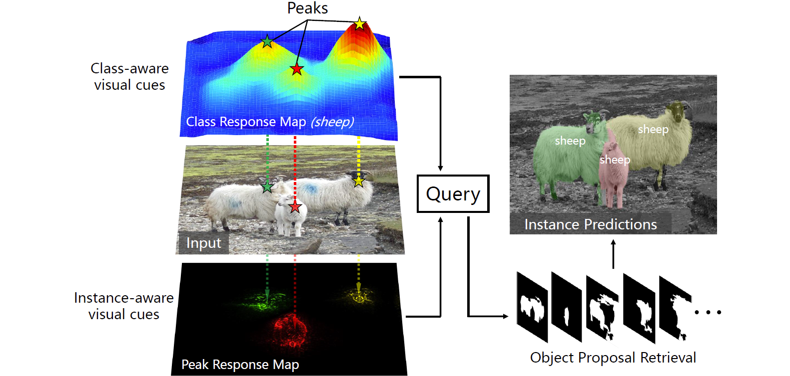
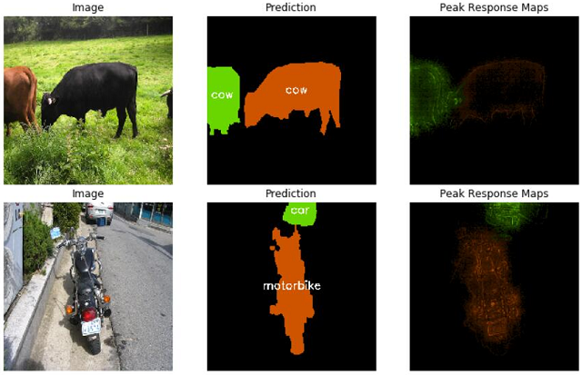

<h2 align="center">Weakly Supervised Instance Segmentation using<br>Class Peak Response</h2>

[](https://github.com/ZhouYanzhao/PRM/tree/pytorch)
[](#)

[[Home]](http://yzhou.work) [[Project]](http://yzhou.work/PRM) [[Paper]](https://arxiv.org/pdf/1804.00880) [[Supp]](http://yzhou.work/PRM/Supplementary.pdf) [[Poster]](http://yzhou.work/PRM/Poster.pdf) [[Presentation]](https://www.youtube.com/embed/lNqXyJliVSo?start=4615&end=4850&autoplay=1&controls=0)



## PyTorch Implementation
The [pytorch branch](https://github.com/ZhouYanzhao/PRM/tree/pytorch) contains:

* the **pytorch** implementation of Peak Response Mapping (Stimulation and Backprop).
* the PASCAL-VOC demo (training, inference, and visualization).

Please follow the instruction below to install it and run the experiment demo.

### Prerequisites
* System (tested on Ubuntu 14.04LTS and Win10)
* NVIDIA GPU + CUDA CuDNN (CPU mode is also supported but significantly slower)
* [Python>=3.5](https://www.python.org)
* [PyTorch>=0.4](https://pytorch.org)
* [Jupyter Notebook](https://jupyter.org/install.html) and [ipywidgets](https://github.com/jupyter-widgets/ipywidgets) (required by the demo):

    ```bash
    # enable the widgetsnbextension before you start the notebook server
    jupyter nbextension enable --py --sys-prefix widgetsnbextension
    ```

### Installation

1. Install [Nest](https://github.com/ZhouYanzhao/Nest), a flexible tool for building and sharing deep learning modules:
    
    > I created Nest in the process of refactoring PRM's pytorch implementation. It aims at encouraging code reuse and ships with a bunch of useful features. PRM is now implemented as a set of Nest modules; thus you can easily install and use it as demonstrated below.

    ```bash
    $ pip install git+https://github.com/ZhouYanzhao/Nest.git
    ```
    

2. Install PRM via Nest's CLI tool:

    ```bash
    # note that data will be saved under your current path
    $ nest module install github@ZhouYanzhao/PRM:pytorch prm
    # verify the installation
    $ nest module list --filter prm
    # Output:
    #
    # 3 Nest modules found.
    # [0] prm.fc_resnet50 (1.0.0)
    # [1] prm.peak_response_mapping (1.0.0)
    # [2] prm.prm_visualize (1.0.0)
    ```

### Run demo

1. Install Nest's build-in Pytorch modules:

    > To increase reusability, I abstracted some features from the original code, such as network trainer, to build Nest's built-in pytorch module set.
    
    ```bash
    $ nest module install github@ZhouYanzhao/Nest:pytorch pytorch
    ```

2. Download the PASCAL-VOC2012 dataset:

    ```bash
    mkdir ./PRM/demo/datasets
    cd ./PRM/demo/datasets
    # download and extract data
    wget http://host.robots.ox.ac.uk/pascal/VOC/voc2012/VOCtrainval_11-May-2012.tar
    tar xvf VOCtrainval_11-May-2012.tar
    ```

3. Run the demo experiment via [demo/main.ipynb](https://github.com/ZhouYanzhao/PRM/tree/pytorch/demo/main.ipynb)

    

## Citation 
If you find the code useful for your research, please cite:
```bibtex
@INPROCEEDINGS{Zhou2018PRM,
    author = {Zhou, Yanzhao and Zhu, Yi and Ye, Qixiang and Qiu, Qiang and Jiao, Jianbin},
    title = {Weakly Supervised Instance Segmentation using Class Peak Response},
    booktitle = {CVPR},
    year = {2018}
}
```
